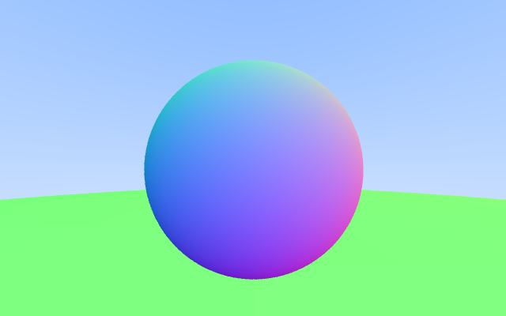

# Intro
This project is a Rust based Raytracer based on Peter Shirley's Ray Tracking books found here: https://github.com/RayTracing/raytracing.github.io

There are 3 books in the series (V4.0.1):
- Ray Tracing: In One Weekend
- Ray Tracing: The Next Week
- Ray Tracing: The Rest of Your Life

The goal is to implement as many of the tools/features/techniques in this series under one Rust package.

# Getting Started (Linux)

* Clone this repo
* cd raytracer
* cargo build
* Run the main app in 1 of 2 ways:
    * cargo run
    * `./target/debug/raytracer <args>`

The app provides some command-line options should you want to alter the height/width

```
pfd@eigen2:~/projects/raytracer/raytracer$ ./target/debug/raytracer --help
Raytracer 0.1.0
Fil Dourado <fildourado91@gmail.com>
Simple Raytracer

USAGE:
    raytracer [FLAGS] [OPTIONS] [SUBCOMMAND]

FLAGS:
        --help       Prints help information
    -V, --version    Prints version information
    -v               Sets the level of verbosity

OPTIONS:
    -c, --config <FILE>      Sets a custom config file
    -h, --height <HEIGHT>    Sets the height for the output window
    -w, --width <WIDTH>      Sets the width for the output window

SUBCOMMANDS:
    help    Prints this message or the help of the given subcommand(s)
    test    controls testing features

```


# What's left?
* Diffuse Materials
* Positionable Camera
* Defocus Blur


# Output

## Singular Object in Scene
